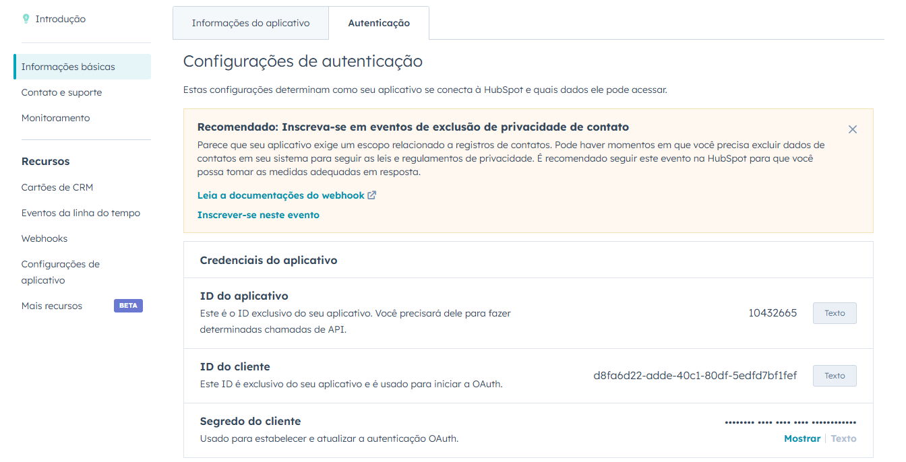
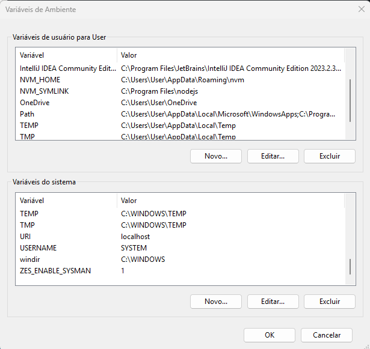
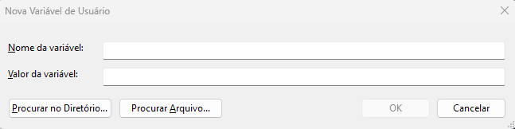
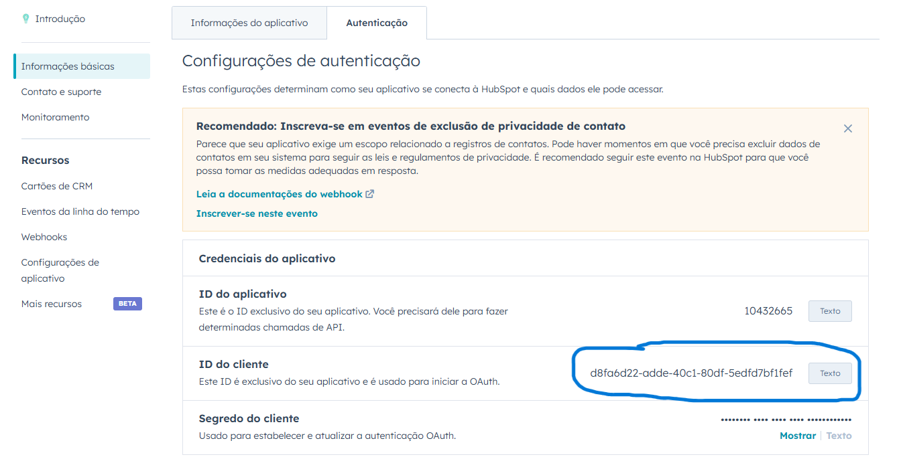
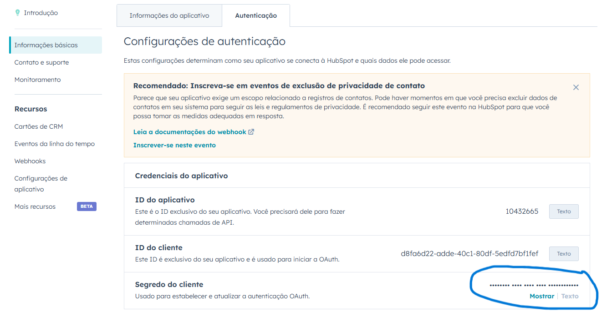

# HubSpot Integration API

## Descrição

Este projeto é uma API para integração com o HubSpot, utilizando OAuth2 para autenticação e Webhooks para receber atualizações sobre eventos do HubSpot. Ele permite a criação de contatos no HubSpot e valida a assinatura dos webhooks recebidos para garantir a autenticidade das requisições.

## Funcionalidades

- **Autenticação OAuth2**: O projeto utiliza OAuth2 para autenticação com a API do HubSpot.
- **Criação de Contatos**: Permite criar contatos no HubSpot usando a API.
- **Validação de Webhooks**: Valida a assinatura dos webhooks recebidos, garantindo que são enviados pela HubSpot.

## Tecnologias Usadas

- **Spring Boot**: Framework para construção de aplicações Java baseadas em Spring.
- **Bean Validation**: Usado para validar as entradas da API, garantindo que os dados recebidos nos endpoints estejam no formato correto e sigam as regras definidas
- **WebFlux**: Usado para realizar chamadas assíncronas à API do HubSpot.
- **Jackson**: Usado para manipulação de JSON.
- **Lombok**: Usado para reduzir a verbosidade do código, gerando automaticamente getters, setters, etc.
- **Maven**: Usado para gerenciar as dependencias da aplicação.
- **Ngrok**: Usado para criar um canal de comunicação entre HubSpot e a maquina, trantando ela como um servidor na nuvem.

## Instruções para Execução

### Requisitos iniciais

- Instalar o [Java 17](https://adoptopenjdk.net/).
- Criar uma [Conta](https://ngrok.com/) e intalar o [Ngrok](https://ngrok.com/downloads/windows).
- Criar uma Conta de desenvolvedor na plataforma da [Hubspot](https://app.hubspot.com/login)
- Criar e configurar um aplicativo publico com base na documentação da [Hubspot]([https://app.hubspot.com/login](https://developers.hubspot.com/docs/guides/apps/public-apps/overview))
- Criar uma conta de teste de desenvolvedor na Hubspot

**OBS**: Quando for baixar o app do ngrok será necessário desabilitar seu antivirus caso o tenha, ou criar uma excessão para o ngrok. Essa ação será necessária pois antivirus conhece o ngrok como ferramenta maliciosa. Ela pode ser utilizada para ter acesso as informações pessoais de uma determinada maquina. Isso faz com que o antivirus suspeite que sua maquina esta sendo hackeada, ou que voce possa tentar realizar atividades maliciosas com a ferramenta. Contundo, nesse projeto ele tem uma função muito importante que é abrir um canal de comunicação com a HubSpot, de forma que a plataforma interprete a execução da api local como se fosse de uma api rodando em um servidor na nuvem (Heroku, AWS, etc). Essa decisão foi tomada pelo fato de que a HubSpot não aceita a rota "localhost" para validação de webhooks.

## Configuração do ambiente

### Variáveis de ambiente

1. Após concluir a criação do seu aplicativo público na plataforma da Hubspot, clique nele.
2. Em seguida acesse a opção "Informações básicas" listada na lateral.
3. Em seguida acesse a aba "Autenticação".
4. Ao acessar esta aba, você irá se deparar com a seguinte tela:

5. Agora vá ate a barra de pesquisa do windows e digite "Editar as variaveis de ambiente do sistema", em seguida clique em "enter"
6. Agora selecione a opção "variaveis de ambiente". Ao clicar nessa opção irá aparecer a seguinte tela:

7. Agora em "Variaveis de usuário SEU_USUARIO" iremos criar duas variaveis de ambiente, HUBSPOT_CLIENT_ID e HUBSPOT_CLIENT_SECRET
8. Ainda em "Variaveis de usuário SEU_USUARIO", clique em na opção "Novo..."
9. Ao clicar nessa opção irá aparecer a seguinte imagem:

10. No campo "nome da variável" você irá preencher com HUBSPOT_CLIENT_ID
11. Agora no campo "valor da variável" iremos colocar o valor que aparecer neste campo aplicativo. No meu caso apareceu esse valor que mostra na imagem, mas cada aplicativo tem o seu, então o valor a ser utilizado será o que estiver no seu aplicativo.

12. Após preencher os dois campos, clique em "ok"
13. Agora iremos repetir o mesmo processo para criar a variavel de ambiente HUBSPOT_CLIENT_SECRET. HUBSPOT_CLIENT_SECRET será o "nome da variável". Já "valor da variável" iremos utilizar o indicado na imagem. Para ter acesso ao valor, basta clicar em "Mostrar".

14. Após preencher os dois campos, clique em "ok"
15. Clique "ok". Em seguida, clicar em "aplicar" e depois "ok"
16. Feito isso, reinicie sua maquina para evitar transtornos quanto ao carregamento das variaveis de ambiente durante a execução do projeto.

