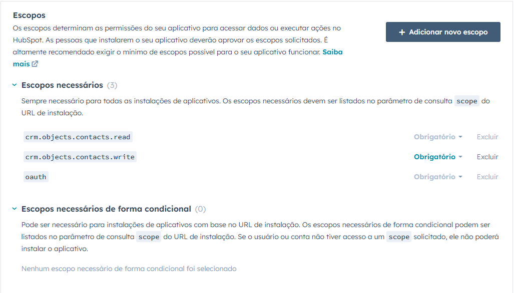
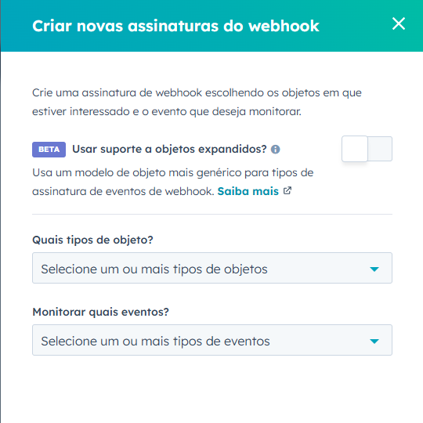

# HubSpot Integration API

## Descrição

Este projeto é uma API para integração com o HubSpot, utilizando **OAuth2** para autenticação e **Webhooks** para receber atualizações sobre eventos do HubSpot. Ele permite a criação de contatos no HubSpot e valida a assinatura dos webhooks recebidos para garantir a autenticidade das requisições.

## Funcionalidades

- **Autenticação OAuth2**: O projeto utiliza OAuth2 para autenticação com a API do HubSpot.
- **Criação de Contatos**: Permite criar contatos no HubSpot usando a API.
- **Validação de Webhooks**: Valida a assinatura dos webhooks recebidos, garantindo que são enviados pela HubSpot.

## Tecnologias Usadas

- **Spring Boot**: Framework para construção de aplicações Java baseadas em Spring.
- **Bean Validation**: Usado para validar as entradas da API, garantindo que os dados recebidos nos endpoints estejam no formato correto e sigam as regras definidas.
- **WebFlux**: Usado para realizar chamadas assíncronas à API do HubSpot.
- **Jackson**: Usado para manipulação de JSON.
- **Lombok**: Usado para reduzir a verbosidade do código, gerando automaticamente getters, setters, etc.
- **Maven**: Usado para gerenciar as dependências da aplicação.
- **Ngrok**: Usado para criar um canal de comunicação entre o HubSpot e a máquina local, tratando ela como um servidor na nuvem.

## Instruções para Execução

### Requisitos Iniciais

1. Instalar o [Java 17](https://adoptopenjdk.net/).
2. Criar uma conta gratuita na plataforma do [ngrok](https://ngrok.com/).
3. Criar uma conta gratuita de desenvolvedor na plataforma da [HubSpot](https://app.hubspot.com/login).
4. Criar um aplicativo público com base na documentação da [HubSpot](https://developers.hubspot.com/docs/guides/apps/public-apps/overview).

## Configuração do Ambiente

### Variáveis de Ambiente

1. Após concluir a criação do seu aplicativo público na plataforma da HubSpot, clique nele.
2. Acesse a opção **"Informações básicas"** listada na lateral.
   
3. Em seguida, acesse a aba **"Autenticação"**.
   
4. Na aba **Autenticação**, você verá a seguinte tela:
   
5. Agora, vá até a barra de pesquisa do Windows e digite **"Editar as variáveis de ambiente do sistema"**, depois pressione **Enter**.
6. Clique na opção **"Variáveis de ambiente"**. Ao clicar nessa opção, aparecerá a seguinte tela:
   
7. Em **"Variáveis de usuário"**, crie duas variáveis de ambiente: **HUBSPOT_CLIENT_ID** e **HUBSPOT_CLIENT_SECRET**.
8. Clique em **Novo...** para adicionar a variável.
   
9. No campo **"Nome da variável"**, preencha com **HUBSPOT_CLIENT_ID**.
10. No campo **"Valor da variável"**, coloque o valor exibido no seu aplicativo HubSpot (veja a imagem como referência).
   
11. Clique em **OK**.
12. Repita o processo para criar a variável **HUBSPOT_CLIENT_SECRET**, usando o valor indicado na interface da HubSpot.
   
13. Clique em **OK** novamente para fechar a janela de variáveis de ambiente.
14. Clique em **Aplicar** e depois em **OK** para finalizar a configuração.
15. Após isso, reinicie a máquina para garantir que as variáveis de ambiente sejam capturadas pelo sistema operacional.

---

### Ngrok

Após criar uma conta gratuita na plataforma do [ngrok](https://ngrok.com/), conforme indicado nos passos iniciais, vamos iniciar a instalação e configuração do ngrok na nossa máquina.

**IMPORTANTE**: Durante o processo de download e instalação do ngrok, será necessário desabilitar o antivírus, caso você tenha um, ou criar uma exceção para o ngrok. Isso ocorre porque muitos antivírus interpretam o ngrok como uma ferramenta maliciosa. Isso se deve ao fato de que, em algumas situações, hackers usam o ngrok para criar túneis de acesso remoto à máquina da vítima. No entanto, para a nossa aplicação, o ngrok será utilizado de maneira legítima, sem qualquer viés de ataque. O ngrok é extremamente útil para testes de APIs, webhooks e desenvolvimento remoto. No nosso caso, ele será usado para criar um túnel seguro entre o nosso servidor local (localhost) e o servidor da HubSpot, permitindo a comunicação com a HubSpot, que não aceita a rota "localhost" para validação de webhooks.

1. Baixe o [ngrok](https://ngrok.com/downloads/windows).
2. Após o download, conceda permissão ao antivírus ou desative-o temporariamente. Extraia o arquivo `.zip` baixado.
3. Em seguida, vá até a barra de pesquisa do Windows e digite **"Windows PowerShell"**. Deixe-o aberto em segundo plano.
4. Acesse sua conta no site do [ngrok](https://ngrok.com/). Ao fazer login, você verá a seguinte tela:
   
5. No menu à esquerda, acesse a opção **"Your Authtoken"** (ou "Seu Authtoken").
   
6. Você será direcionado para uma página que exibirá o seu token, que autoriza o uso do ngrok na sua máquina.
   
7. Clique no ícone do "olho mágico" para exibir seu token.
8. Em seguida, será exibido o comando para configurar o token na sua máquina: `ngrok config add-authtoken $YOUR_AUTHTOKEN`. Copie esse comando.

**IMPORTANTE**: No lugar de **$YOUR_AUTHTOKEN**, ficará o seu token de acesso. Se você clicou no ícone do "olho mágico" para exibir a senha, automaticamente a variável será preenchida com o valor do seu token. Veja o exemplo abaixo:
   
   
9. Após copiar o comando, volte para o **PowerShell** e cole o comando copiado.

10. Pressione **Enter**. Se tudo estiver correto, você verá uma mensagem de sucesso confirmando que o token foi salvo na sua máquina. Caso contrário, verifique se o comando foi copiado e colado corretamente.

11. Por fim, iremos executar o ngrok. Para isso digite o seguinte comando: "& "C:\Users\User\Documents\João Pedro\Pessoal\ngrok.exe" http 8080 --log=stdout".

12. Ao digitar o comando, pressione Enter. Você deverá ver algo semelhante a isso:

IMPORTANTE: Atente-se ao caminho do seu ngrok. Se você observar, para o comando funcionar você precisa fornecer a localização exata do seu ngrok em sua máquina, do contrário o comando não irá rodar o ngrok. No meu caso, o ngrok está localizado em C:\Users\User\Documents\João Pedro\Pessoal\ngrok.exe.

13. Feito isso, o ngrok agora estará rodando em sua máquina.

IMPORTANTE: Após executar o último comando, não feche o PowerShell ou aperte Ctrl+C. O ngrok só cria o túnel de acesso à máquina local durante sua execução. Então, caso você feche o PowerShell ou interrompa o processo de execução do ngrok com Ctrl+C, será necessário executar novamente o comando:

---

### HubSpot - Aplicativo Público

Após ter configurado o ngrok localmente, iremos configurar o nosso aplicativo público na plataforma HubSpot.

1. Clique no seu aplicativo público.
2. Em seguida, acesse a opção **"Informações básicas"** listada na lateral.
   
3. Em seguida, acesse a aba **"Autenticação"**.
   
4. Ao acessar esta aba, rolando um pouco mais para baixo, você irá se deparar com o seguinte campo:
   
5. Cole a seguinte URL: `localhost:8080/api/hubspot/callback`.
6. Em seguida, role mais para baixo e você irá se deparar com essa parte:
   
7. Agora, clique no botão **"Adicionar novo escopo"**.
8. Procure pelos escopos: **"crm.objects.contacts.read"** e **"crm.objects.contacts.write"**.
9. Após encontrá-los, selecione ambos e salve-os. Ao fazer isso, eles serão listados como na imagem anterior.

   **IMPORTANTE**: Iremos utilizá-los na função de criar contato, então é fundamental definir esses escopos como parte do nosso aplicativo.

10. Feito isso, na parte inferior da tela, irá aparecer a seguinte opção:
    
11. Clique em **"Salvar alterações"**.
12. Após salvar, role para cima até aparecer as opções iniciais listadas na barra lateral. Em seguida, clique em **"Webhooks"**.
    
13. Após entrar na tela de **Webhooks**, você verá um campo vazio que espera uma URL. Nesse campo, iremos colocar a URL que dará acesso ao endpoint da nossa API.
14. Inicialmente, abra o **PowerShell** que estava em segundo plano.
15. Em seguida, copie a URL gerada pelo comando: `& "C:\Users\User\Documents\João Pedro\Pessoal\ngrok.exe" http 8080 --log=stdout`.
    
16. Após copiar a URL, iremos concatená-la com o seguinte caminho: `/api/hubspot/webhook`.
17. Dessa forma, a URL final que devemos colocar na plataforma será: `SUA_URL_GERADA_NO_NGROK/api/hubspot/webhook`. No meu caso, ficou `https://dea5-170-150-203-129.ngrok-free.app/api/hubspot/webhook`.
18. Após montar a URL, cole-a no campo que espera a URL. Em seguida, salve as alterações.

**IMPORTANTE**: Essa URL é dinâmica, ou seja, sempre que você executar o comando que faz o ngrok rodar, ele irá gerar uma nova URL. Por isso, é importante deixar o ngrok aberto/minimizado. Sempre que você fechar o PowerShell, terá que fazer todo esse processo novamente, incluindo a atualização da URL gerada.

19. Após salvar a URL no campo, o botão **"Criar assinatura"** será liberado. Clique nele.
    
20. Ao clicar nele, aparecerá a seguinte aba:
    
21. Nela, iremos escolher qual objeto e qual ação queremos que o webhook monitore. Como estamos lidando com a criação de contatos, escolheremos no primeiro campo a opção **"Contato"** e no segundo campo a opção **"Criado"**.
    
22. Agora, clique em **Assinar**. Feito isso, sua tela estará assim:
    
23. Agora, selecione a caixa de diálogo ao lado da palavra **"Contato"**. Ao fazer isso, aparecerão as opções **"Ativar"** e **"Pausar"**. Clique em **"Ativar"**. Feito isso, seu aplicativo agora passará a monitorar eventos relacionados à criação de contatos.

**IMPORTANTE**: Caso você tenha fechado o PowerShell e perdido a URL do ngrok e precise alterar a URL no seu aplicativo, você precisa primeiro pausar a assinatura. Só assim o HubSpot permitirá a alteração da URL. Para isso, selecione a caixa de diálogo ao lado da palavra **"Contato"**. Ao fazer isso, aparecerão as opções **"Ativar"** e **"Pausar"**. Clique em **"Pausar"**. Feito isso, você poderá alterar a URL. Após alterar, clique em **Ativar** novamente para restabelecer a função do seu aplicativo de monitoramento.

---

### HubSpot - Conta de Teste

Para conseguirmos visualizar que estamos conseguindo criar os contatos, precisamos ter uma conta de teste responsável por listar os contatos criados. Para isso, iremos criar uma conta de teste de desenvolvedor.
